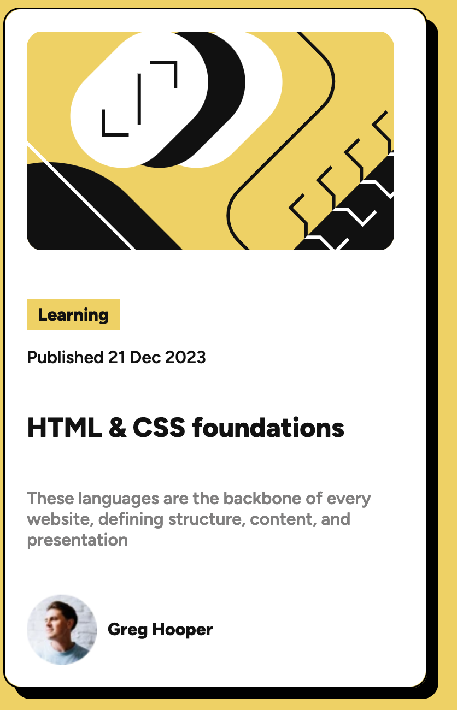

# Frontend Mentor - Blog preview card solution

## Table of contents

- [Overview](#overview)
  - [The challenge](#the-challenge)
  - [Screenshot](#screenshot)
  - [Links](#links)
- [My process](#my-process)
  - [Built with](#built-with)
- [Author](#author)

## Overview

### The challenge

Users should be able to:

- See hover and focus states for all interactive elements on the page

### Screenshot

### Links

- Solution URL: https://akari08-mp4.github.io/blog-preview/

## My process

### Built with

- Semantic HTML5 markup
- CSS
- Flexbox

## Author

- Website - https://www.harpsicord.carrd.co
- Frontend Mentor - https://www.frontendmentor.io/profile/akari08-mp4
